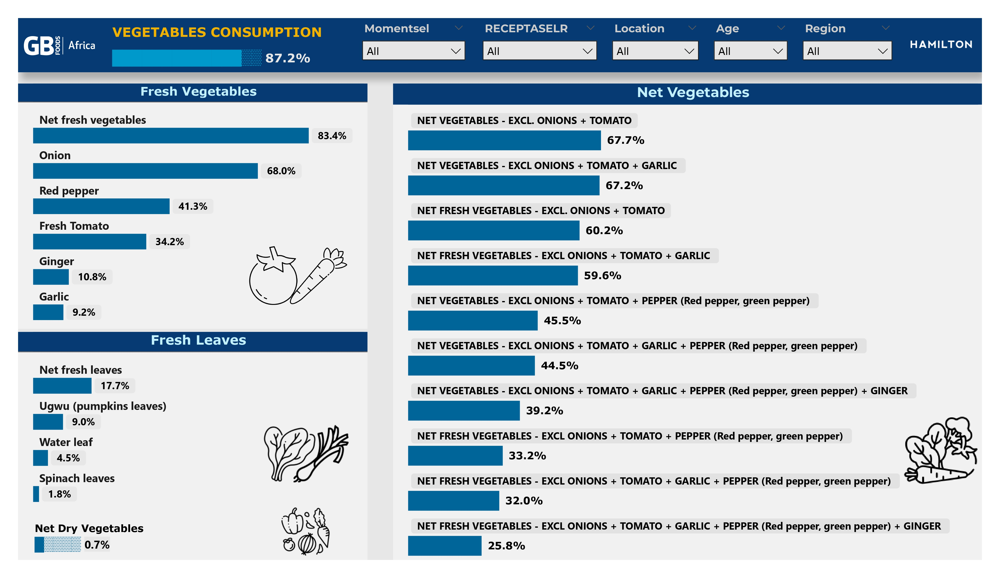
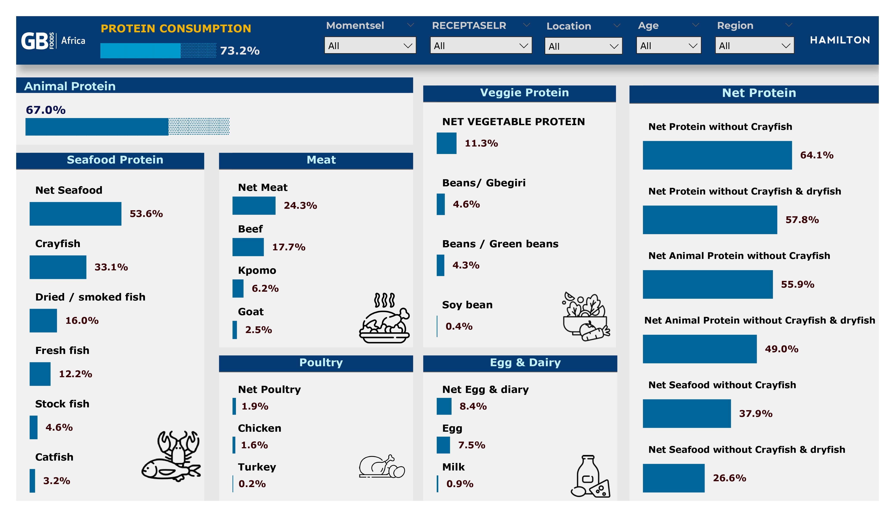
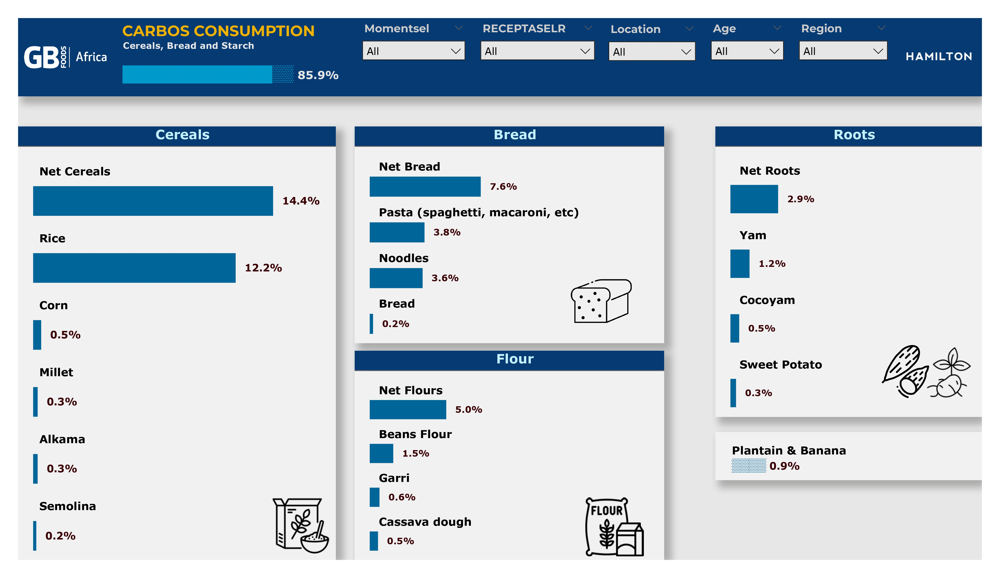
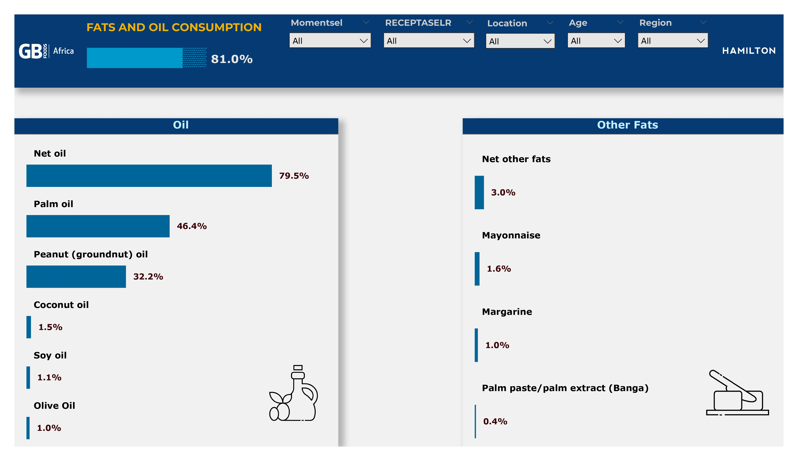
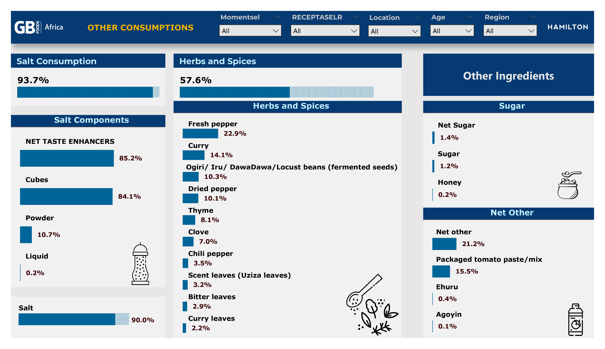

# Culinary-Map-PowerBI
Power BI dashboard analyzing regional food consumption patterns and trends, uncovering dietary habits, seasonality, and key culinary insights across locations.

## Data Source
SPSS(.sav) file was the source.
I extracted excel file using R script.

## 🛠 Tools Used  

- **R** → Data conversion from `.sav` to `.xlsx`
- **Excel** → Data Cleaning and filtering to add only relevant data. 
- **Power BI** → Data modeling (**DAX**), transformation (**Power Query**), and Visualization.

## 📸 Dashboard Preview  

  
  
  
  
  
  

---

