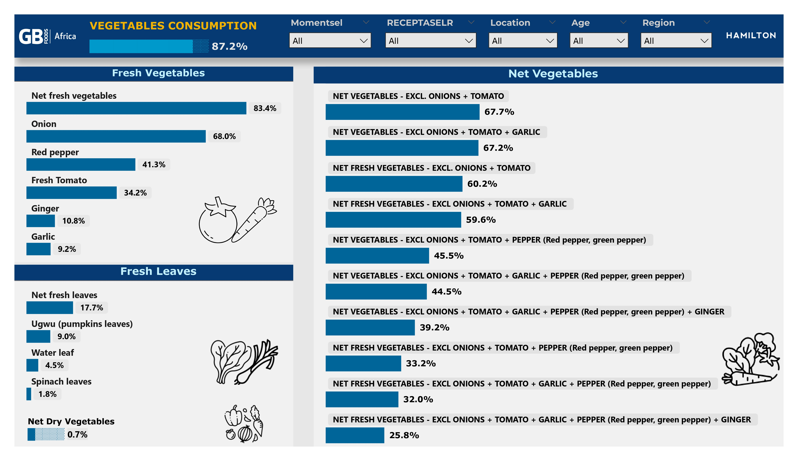
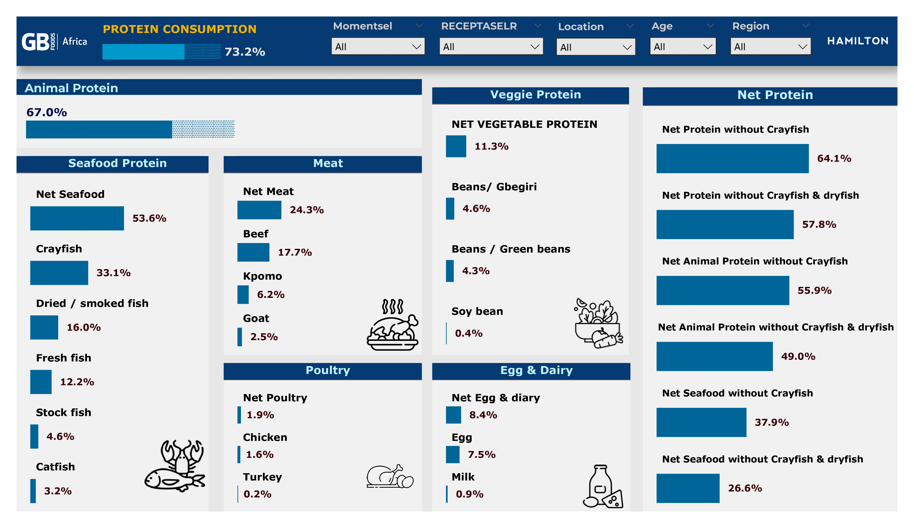
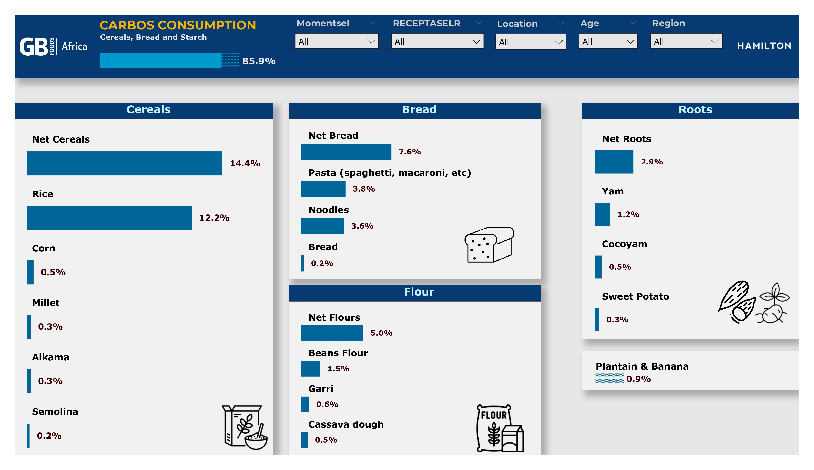
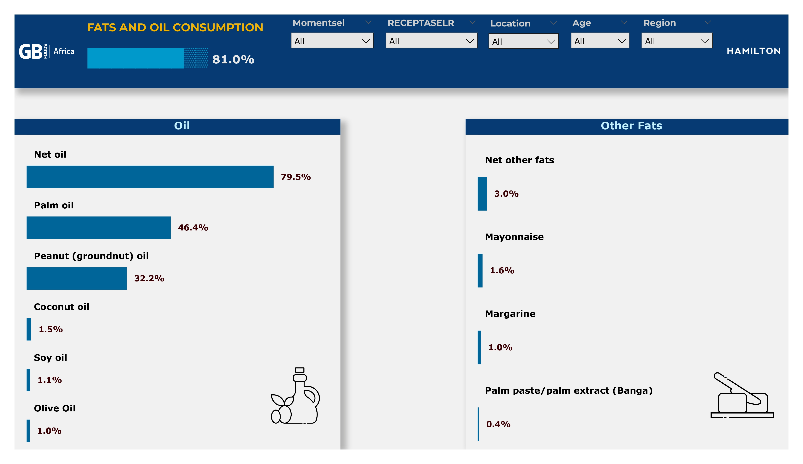
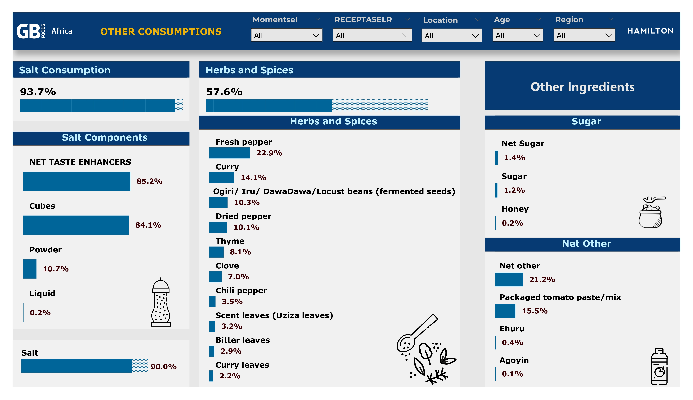

# Culinary-Map-PowerBI
Power BI dashboard analyzing regional food consumption patterns and trends, uncovering dietary habits, seasonality, and key culinary insights across locations.

## Data Source
SPSS(.sav) file was the source.
I extracted excel file using R script.

## 📸 Dashboard Preview  

  
  
  
  
  
  

---

